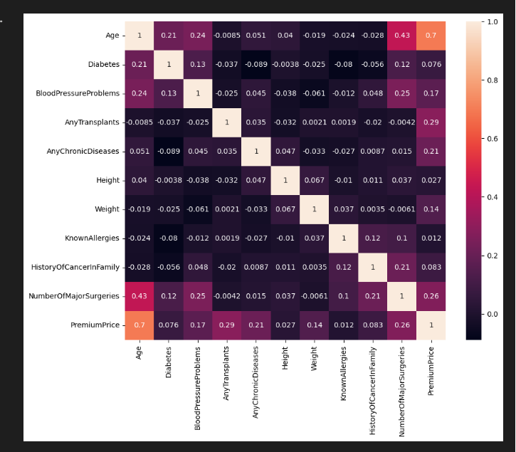
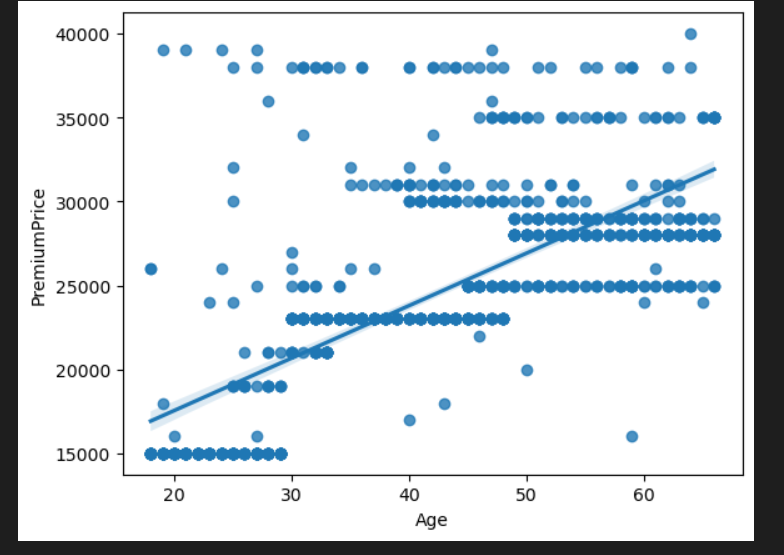

# Laporan Proyek Machine Learning

### Nama : MUHAMAD FAJAR AL FIKRI

### Nim : 211351087

### Kelas : MALAM Bb

## Domain Proyek : Estimasi harga asuransi


Kesehatan adalah salah satu prioritas tertinggi yang ada pada kehidupan makhluk hidup khususnya manusa, dengan kesehatan yang baik maka
manusia dapat mencapai berbagai hal dalam hidupnya. Namun kesehatan tidaklah murah, melihat hal itu banyak perusahaan-perusahaan yang
menciptakan suatu bisnis asuransi kesehatan, Asuransi Kesehtan adalah suatu bentuk perjanjian atau kontrak yang melibatkan dua pihak, yaitu perusahaan asuransi dan pemegang polis (tertanggung), di mana pemegang polis membayar premi kepada perusahaan asuransi untuk mendapatkan perlindungan atau kompensasi finansial dalam hal terjadinya kerugian atau kejadian yang tertentu, seperti kecelakaan, penyakit, dll. Asuransi bertujuan untuk memberikan perlindungan finansial dan mengurangi risiko keuangan yang mungkin timbul akibat peristiwa tak terduga.

Dengan perkembangan teknologi dan informasi, terutama dalam hal algoritma pembelajaran mendalam (deep learning) dan machine learning, telah membuatnya lebih mudah dan efisien untuk mengolah dan menganalisis data dalam skala besar. Hal ini membuatnya cocok untuk masalah peramalan harga asuransi. Hal ini diperlukan agar konsumen atau pemegang polis dapat merencanakan dan memilih program asuransi kesehatan
dengan lebih baik

## Business Understanding

### Problem Statements

- Banyaknya perusahaan Asuransi dan program Asuransi sehingga konsumen bingung untuk memilih.
- Konsumen kerap kesusahan untuk menyusun rencana finansial khususnya untuk sisi kesehatan.

### Goals

- Konsumen dapat meramalkan jumlah biaya yang dikeluarkan untuk asuransi kesehatan dalam setahun.

### Solution statements

- Membangun suatu sistem yang dapat mempelajari suatu data (Machine Learning) melakukan estimasi harga asuransi kesehatan dalam setahun
- Sistem berjalan dengan menggunakan metode Regresi Linear yang dinilai cocok untuk melakukan estimasi.

## Data Understanding

Dataset yang digunakan berasal dari situs Kaggle. Dataset ini mengandung 986 entries dan 11 columns<br>

Link Dataset: [Medical Insurance Cost](https://www.kaggle.com/datasets/tejashvi14/medical-insurance-premium-prediction/data).

### Variabel-variabel yang terdapat pada Dataset adalah sebagai berikut:

- Age = Umur Konsumen
- Diabetes = Riwayat Diabetes (0=tidak, 1=iya)
- BloodPressureProblems = Apakah Orang tersebut Memiliki Tingkat Tekanan Darah Tidak Normal (0=tidak, 1=iya)
- AnyTransplants = Riwayat Transplantasi Organ Utama Apa Pun (0=tidak, 1=iya)
- AnyChronicDiseases = Apakah Pelanggan Menderita Penyakit Kronis Seperti Asthama, Dll. (0=tidak, 1=iya)
- Height = Height Of Customer
- Weight = Weight Of Customer
- KnownAllergies = Apakah Pelanggan Diketahui Memiliki Alergi (0=tidak, 1=iya)
- HistoryOfCancerInFamily = Apakah ada kerabat sedarah pelanggan yang menderita kanker dalam bentuk apa pun (0=tidak, 1=iya)
- NumberOfMajorSurgeries = Jumlah Operasi Besar yang Dijalani Orang tersebut
- PremiumPrice = Harga Asuransi Perthaun

## Data Preparation

Pertama-tama mari import semua library yang dibutuhkan,

```bash
import pandas as pd
import numpy as np
import matplotlib.pypot as plt
import seaborn as sns
```

Setelah itu kita akan men-definsikan dataset menggunakan fungsi pada library pandas

```bash
df = pd.read_csv('Medicalpremium.csv')
```

Lalu kita akan melihat informasi mengenai dataset dengan syntax seperti dibawah:

```bash
df.info()
```

Dengan hasil sebagai berikut:

```bash
<class 'pandas.core.frame.DataFrame'>
RangeIndex: 986 entries, 0 to 985
Data columns (total 11 columns):
 #   Column                   Non-Null Count  Dtype
---  ------                   --------------  -----
 0   Age                      986 non-null    int64
 1   Diabetes                 986 non-null    int64
 2   BloodPressureProblems    986 non-null    int64
 3   AnyTransplants           986 non-null    int64
 4   AnyChronicDiseases       986 non-null    int64
 5   Height                   986 non-null    int64
 6   Weight                   986 non-null    int64
 7   KnownAllergies           986 non-null    int64
 8   HistoryOfCancerInFamily  986 non-null    int64
 9   NumberOfMajorSurgeries   986 non-null    int64
 10  PremiumPrice             986 non-null    int64
dtypes: int64(11)
memory usage: 84.9 KB
```

<br>

Kita juga akan melihat tingkat korelasi antar kolom



Jika kita perhatikan bahwa kolom Age adalah kolom yang sangat berpengaruh terhadap kolom PremiumPrice (0.7) yang menandakan bahwa semakin tinggi usia semakin tinggi biaya untuk asuransi kesehatan

Selanjutnya memeriksa apakah ada data yang berisi nilai null pada dataset:

```bash
df.isna().sum()
```

Dengan hasil sebagai berikut:

> Age 0
> Diabetes 0
> BloodPressureProblems 0
> AnyTransplants 0
> AnyChronicDiseases 0
> Height 0
> Weight 0
> KnownAllergies 0
> HistoryOfCancerInFamily 0
> NumberOfMajorSurgeries 0
> PremiumPrice 0
> dtype: int64

 <br>

Setelah memeriksa bahwa dataset yang kita gunakan tidak terdapat nilau null / NaN, maka tahap cleaning tidak diperlukan.
Dan setelah memeriksa tipe data yang digunakan adalah int64, maka tahap transformasi tidak perlu dilakukan.

### Membuat feature

Feature digunakan sebagai parameter menghitung hasil estimasi/prediksi yang diharapkan. Hasil estimasi di dataset ini adalah kolom PremiumPrice. Untuk membuat feature dan target dengan codingan sbgai berikut:

```bash
features = ['Age','Diabetes','BloodPressureProblems','AnyTransplants','AnyChronicDiseases','Height','Weight','KnownAllergies','HistoryOfCancerInFamily','NumberOfMajorSurgeries']
x = df[features]
y = df['PremiumPrice']
x.shape, y.shape
```

### Split Dataset untuk Training dan Testing

Ketika akan melakukan proses perhitungan dengan metode regresi linear, maka dataset harus dibagi menjadi dua jenis yaitu training dan testing. Split dataset menggunakan fungsi train_test_split.

```bash
from sklearn.model_selection import train_test_split
x_train, x_test, y_train, y_test = train_test_split(x,y,random_state=34,test_size=0.1)
x_test.shape
x_train.shape
```

> (887, 10) (99, 10)

Disini kita mendapatkan 887 data untuk data training, dan 99 data untuk data
tesing.

## Modeling

Pada tahap modeling, kita akan menggunakan metode Regresi Linear yang sudah kita import melalui library sklearn.

```bash
from sklearn.linear_model import LinearRegression
lr = LinearRegression()
lr.fit(x_train,y_train)
pred = lr.predict(x_test)
```

Kita akan melihat salah satu contoh hasil dari model regresi linear kita, yaitu pengaruh RAM terhadap Harga(Price)


Lalu berikut adalah skor akurasi dari model yang kita buat

```bash
score = lr.score(x_test,y_test)
print('Akurasi model Regresi Linear', score)
```

> Akurasi model Regresi Linear 0.7267247299878619

## Evaluation

Pada model estimasi, salah satu metrik evaluasi yang cocok digunakan untuk menilai kelayakan model yang telah dibangun adalah R2 Score atau R-Square.
Metode R-square ini merupakan metode yang paling sering digunakan. Metode ini akan memberikan bobot sangat tinggi untuk kesalahan absolut besar. Oleh karena itu, nilai R2 yang tinggi tidak dapat diperoleh dari matriks berjumlah sel besar dengan kesalahan kecil, tetapi sangat jelek pada nilai sel yang kecil. RMSE tidak memiliki persamaan:


Mari kita implementasi metrik evaluasi R-square pada model yang telah kita bangun:

```bash
from sklearn.metrics import r2_score

r2_score(y_test, pred)
```

> 0.7267247299878619

Didapatkan hasil sebesar 0.7267247299878619. Dengan hasil seperti itu maka model yang kita gunakan sudah cukup layak.

## Deployment

Link Streamlit:
